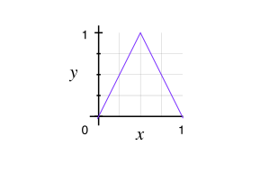
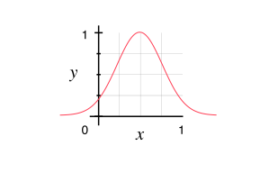

# Geiger
Francis Tseng

---

## Contextual IDFs

Three contexts of IDF (inverse document frequency) for a term $t$, which are all normalized:

- $idf_g(t)$ - global IDF
- $idf_i(t)$ - internal (intra-comment) IDF

A high IDF means a term appears very infrequently, and a low IDF means a term appears very frequently.

The formulae for computing IDF are sundry; the one used here is:

$$
idf(t) = ln(\frac{N}{d_t} + 1)
$$

Where $N$ is the total number of documents and $d_t$ is the number of documents a given term appears in.

The global IDF map was computed from about 120k New York Times articles.

## The intuition

- Comments which make similar or related points will use a similar set of _salient_ terms which are not present in comments making different points.
- A term is _salient_ for a given IDF context if its normalized IDF is not in the lower or upper extremes.
- A term is _noise_ for a given IDF context if its normalized IDF is very low – it appears too frequently to discern comments. It's expected that these terms include generic verbs, for example.
- A term is also _noise_ for a given IDF context if its normalized IDF is very high – it appears too infrequently to discern comments. It's expected that these include rhetorical flairs and their ilk.

## Salience

To more formally define salience, we say that there is some "ideal" IDF $idf_I$, say $idf_I = 0.5$, which indicates a maximally-salient term.

For the IDF of a given term $t$ for any context $x$, $idf_x(t)$, we can compute the salience in a few different ways:

$$
\text{salience}_x(t) = 1 - 2|idf_I - idf_x(t)|
$$

or as a Gaussian:

$$
\text{salience}_x(t) = \exp \left( \frac{-\left( x-idf_I \right)^{2}}{\alpha} \right)
$$

Where the additional parameter $\alpha$ sets how heavily penalized values far from the ideal are (the lower $\alpha$ is, the higher the penalty). For now $\alpha = 0.05$.

Using a skewed function (e.g. log-normal or skew-normal) and focusing the ideal at a slightly higher IDF (thus favoring rarer terms) did not work so well, though it may warrant further exploration.

There are plenty of other ways salience could be formalized - for example, maybe IDFs in some range, e.g. $[0.4, 0.6]$, should have equal salience.

## Preprocessing

### Keyword and keyphrase extraction

Documents are cleaned (HTML and punctuation removed and made lowercase) and then tokenized into lemmatized keywords and phrases. Keywords are extracted using a Python implementation^[[https://github.com/aneesha/RAKE](https://github.com/aneesha/RAKE)] of RAKE (Rapid Automatic Keyword Extraction, [1]) and phrases are extracted using a Python implementation^[[http://radimrehurek.com/gensim/models/phrases.html](http://radimrehurek.com/gensim/models/phrases.html)] of phrase detection as described in [2]. The phrase detection model was trained on about 120k New York Times articles.

There may be many novel phrases that the phrase model misses, so an additional phrase extraction step is performed. For each document, adjacent tokens are extracted as pairs. If two tokens appear in a space, hyphen, or 'and'-delimited form at or over 80% of the time they occur together, that delimited form is extracted as a new phrase.

This strategy seems effective; the following are novel keyphrases extracted from an article on coal industry regulation:

> 'carbon tax', 'green energy', 'sun and wind', 'clean coal', 'air and water', 'high level', 'slow climate', 'middle class', 'signature environmental', 'mitch mcconnell', 'poor people', 'coal industry', 'true cost', 'clerical error', 'coal miner', 'representative democracy', 'co2 emission', 'power source', 'clean air', 'future generation', 'blah blah', 'ice age', 'planet earth', 'climate change', 'energy industry', 'critical thinking', 'particulate matter', 'coal mining', 'corporate interest', 'solar and wind', 'air act', 'acid rain', 'carbon dioxide', 'heavy metal', 'obama administration', 'monied interest', 'greenhouse gas', 'human specie', 'president obama', 'long term', 'political decision', 'big coal', 'coal and natural', 'al gore', 'bottom line', 'power generation', 'wind and solar', 'nuclear plant', 'global warming', 'human race', 'supreme court', 'environmental achievement', 'renewable source', 'coal ash', 'legal battle', 'united state', 'wind power', 'epa regulation', 'economic cost', 'federal government', 'state government', 'natural gas', 'west virginia', 'nuclear power', 'radioactive waste', 'battle begin', 'coal fire', 'energy source', 'common good', 'renewable energy', 'coal burning', 'nuclear energy', 'big tobacco', 'carbon footprint', 'red state', 'sea ice', 'peabody coal', 'tobacco industry', 'american citizen', 'fossil fuel', 'fuel industry', 'climate scientist', 'carbon credit', 'power plant', 'republican president', 'electricity cost'

### Local Salience

The _local_ salience is then computed for every keyword and keyphrase (henceforth "terms").

The local salience is computed by averaging the global and internal salience:

$$
\text{salience}_l(t) = \frac{\text{salience}_i(t) + \text{salience}_g(t)}{2}
$$

If a term is not present in the global IDF map, only the internal IDF value is used.

### Pruning

The terms are aggressively pruned to remove noisy terms and improve runtime.

Noisy terms are those that:

- appear in one or the fewest documents (IDF is 1)
- are not sufficiently salient ($< 0.5$)
- are totally subsumed by a phrase

## Identifying similar comments

We define similar comments as comments which make similar points or share similar concerns or opinions.

From here we can proceed in a couple different ways.

- We could use local-salience-weighted term frequencies to build vector representations of comments and run that through a conventional clustering algorithm using traditional vector distance metrics (cosine, euclidean, etc).
- We could come up with a novel similarity metric (detailed below) and use that in conjunction with a conventional clustering algorithm.

### Similarity metrics

There are a few possible ways to approach a similarity metric.

First, we represent a comment $c_i$ as a set of its terms, $c_i = \{t_1, \dots, t_n\}$.

Then we can compute its _strong_ similarity like so, which penalizes comments based on their symmetric difference of terms:

$$
\text{sim}_{\text{strong}}(c_i, c_j) = \frac{\sum_{t \in c_i \cap c_j}\text{salience}_l(t) - \sum_{t \in c_i \Delta c_j}\text{salience}_l(t)}{2 \sum_{t \in c_i \cup c_j}\text{salience}_l(t)} + \frac{1}{2}
$$

Or its _weak_ similarity:

$$
\text{sim}_{\text{weak}}(c_i, c_j) = \frac{\sum_{t \in c_i \cap c_j}\text{salience}_l(t)}{\sum_{t \in c_i \cup c_j}\text{salience}_l(t)}
$$

We could also include the term frequencies, where $tf_{t,c}$ indicates the frequency of the term $t$ in the comment $c$, for _term frequency similarity_:

$$
\text{sim}_{\text{tfweak}}(c_i, c_j) = \frac{\sum_{t \in c_i \cap c_j}(\text{salience}_l(t) * (tf_{t,c_i} + tf_{t,c_j}))}{\sum_{t \in c_i \cup c_j}(\text{salience}_l(t) * (tf_{t,c_i} + tf_{t,c_j}))}
$$

This is the weak version, but a strong version can also be defined.

### Semantic similarity metrics

The downside of these similarity metrics is that they only recognize the _direct_ overlap of terms. However, it is possible that a concept has many names, such as "global warning" and "climate change" - these terms are semantically similar.

Leveraging a Python implementation of Word2Vec^[[https://radimrehurek.com/gensim/models/word2vec.html](https://radimrehurek.com/gensim/models/word2vec.html)], as described in [2] and [3], we can capture some notion of semantic similarity. Word2Vec, when trained on a large enough dataset, is proficient at computing how similar two terms are.

To compute the semantic similarity of two tokenized documents, we can construct maximally-similar pairs of terms across both documents and consider those as partial (or complete, if the terms are identical) overlap.

We define the Word2Vec term-similarity of two terms $t_i, t_j$ as $tsim(t_i, t_j)$.

Word2Vec recognizes some phrases, but for those it does not recognize, the phrase is split into unigrams and those unigrams are passed in as a set.

To avoid noise, we are stricter about similarity, defining $tsim_{\text{strict}}(t_i, t_j)$ as:

$$
tsim_{\text{strict}}(t_i, t_j) =
\begin{cases}
tsim(t_i, t_j), & \text{if $tsim(t_i, t_j) >= 0.4$} \\
0, & \text{otherwise}
\end{cases}
$$

The maximally-similar pairs between two documents $c_1, c_2$ are constructed like so:

$$
\begin{aligned}
\text{pairs}_{c_1, c_2} = \{(t_i, \text{argmax}_{t_j \in c_2} tsim_{\text{strict}}(t_i, t_j)) \mid t_i \in c_1 \} \, \cup \\
        \{(t_i, \text{argmax}_{t_j \in c_1} tsim_{\text{strict}}(t_i, t_j)) \mid t_i \in c_2 \}
\end{aligned}
$$

We define the joint salience of two terms as their average salience:

$$
\text{salience}_l(t_1,t_2) = \frac{1}{2}(\text{salience}_l(t_1) + \text{salience}_l(t_2))
$$

With these in hand, we can compute the (weak) semantic similarity:

$$
\text{sim}_{\text{semweak}}(c_i, c_j) = \frac{\sum_{t_i, t_j \in \text{pairs}_{c_i, c_j}} \text{salience}_l(t_i, t_j) * tsim_{\text{strict}}(t_i, t_j)}{\sum_{t_i, t_j \in \text{pairs}_{c_i, c_j}} \text{salience}_l(t_i, t_j)}
$$

### Clustering

There are a lot of clustering algorithms out there, but for this use case DBSCAN seems the best. DBSCAN has a notion of _noise_ - that is, it does not require that every datapoint be part of a cluster - which is useful in this context because there may be many comments which make unique points.

DBSCAN also does not require the number of clusters as a parameter - being density-based, you need to specify neighborhood radius, $\varepsilon$, and a density threshold, but DBSCAN can then independently discover the number of clusters.

One nice-to-have which DBSCAN lacks is the capacity for fuzzy (soft) clustering. It is possible that a comment makes multiple points, some of which overlap with some comments, some of which overlap with other comments, so the notion of fuzzy multi-membership is also useful.

There are a few a fuzzy versions of DBSCAN, described in [DBSCAN-based clustering methods: A short survey](http://www.researchgate.net/profile/Efendi_Nasibov2/publication/233721817_DBSCAN-Based_Clustering_Methods_A_Short_Survey/links/5460978e0cf2c1a63bfe1395.pdf).

There is a [more recent paper describing a fuzzy/soft DBSCAN](http://ieeexplore.ieee.org/xpl/login.jsp?tp=&arnumber=6577851&url=http%3A%2F%2Fieeexplore.ieee.org%2Fxpls%2Fabs_all.jsp%3Farnumber%3D6577851) as well.

The current workaround is to re-compute the DBSCAN clusters over a variety of $\varepsilon$ values and then aggregate the resulting clusters. It's not ideal, though.

## References

1. Rose, S., Engel, D., Cramer, N., & Cowley, W. (2010). Automatic Keyword Extraction from Individual Documents. In M. W. Berry & J. Kogan (Eds.), Text Mining: Theory and Applications: John Wiley & Sons.
2. Tomas Mikolov, Ilya Sutskever, Kai Chen, Greg Corrado, and Jeffrey Dean. Distributed Representations of Words and Phrases and their Compositionality. In Proceedings of NIPS, 2013.
3. Tomas Mikolov, Kai Chen, Greg Corrado, and Jeffrey Dean. Efficient Estimation of Word Representations in Vector Space. In Proceedings of Workshop at ICLR, 2013.